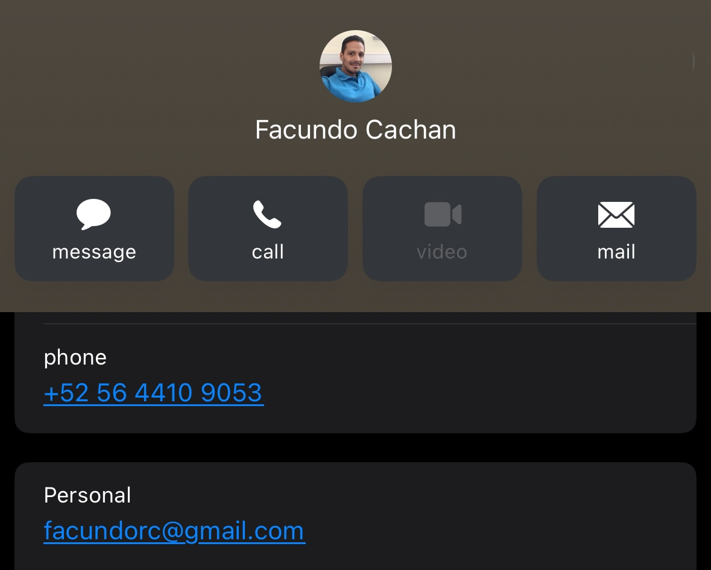

# Challegue 1
## You must achieve with HTML and CSS, the same VCard template that is in the following image:
<figure>
    
</figure>

### Requirements
- You must use HTML and CSS.
- You have 2 days to finish it.

## Notes

### You must work on a new branch called, vCard, and create the PR, with an image of your progress and add me such as Reviewer at your PR.
